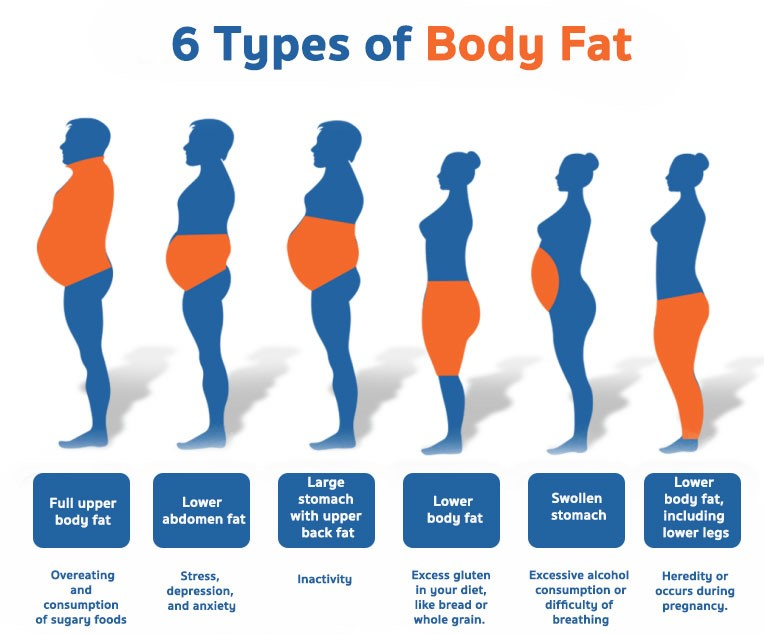

# Body Fat Estimator

## Table of Content
* [Demo](#demo)
* [Overview](#overview)
* [Problem Solving Steps](#problem-solving-steps)
* [About Dataset](#about-dataset)
* [Data Cleaning Techniques](#data-cleaning-techniques)
* [Exploratory Data Analysis](#exploratory-data-analysis)
* [Model Building](#model-building)
* [Model Performance](#model-performance)
* [Deployment](#deployment)
* [Future scope of project](#future-scope-of-project)

## Demo

https://github.com/lawalsegun2025/body_fat_estimator/assets/94943377/a0d05d36-540e-4a63-b798-69e1a3de09be

## Overview

This project model estimates the percentage of body fat in a human's body based on parameters such as weight, height, hip size and many more.
  

  

## Problem Solving Steps
1. Load the dataset into a pandas Data Frame
2. Perform Exploratory Data Analysis on the data
3. Select the appropriate Machine Learning algorithmand fine tune hyperparameters
4. Save model in a pickle file
5. Integrate model with the User Interface using flask web framework
6. Deploy the webapp in a cloud platform

## About Dataset

## Data Cleaning Techniques

## Exploratory Data Analysis

## Model Building

## Model Performance

## Deployment

## Future scope of project

